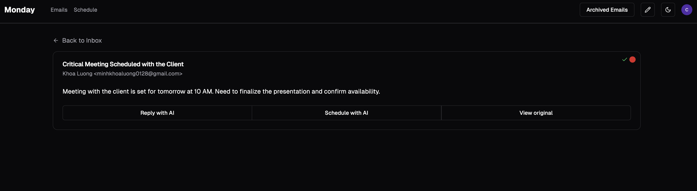

# Monay Productivity

A modern productivity suite that combines email management, smart calendar scheduling, and AI-powered features to streamline your workflow. 5th place HackCWRU winner. [Devpost](https://devpost.com/software/monday-productivity?ref_content=user-portfolio&ref_feature=in_progress)

## Features

- Automatic email summarization and prioritization
- AI-powered email response suggestions
- Email archiving and organization
- AI-powered event scheduling from emails
- Smart scheduling based on busy times and preferences
- Natural language event creation
- Google Calendar, Gmail integration

## Screenshots 
  
  


## Tech Stack

- **Frontend**: Next.js, TypeScript, React  
- **UI Components**: Shadcn UI  
- **Authentication**: Clerk  
- **AI Integration**: OpenAI GPT-4o  
- **APIs**: Google Gmail, Google Calendar  
- **State Management**: React Hook Form, Zod  
- **ORM**: Prisma  
- **Database**: PostgreSQL  


## Getting Started

### Prerequisites

- Node.js
- npm or yarn
- Google Cloud Platform account
- OpenAI API key
- Clerk account

### Environment Setup

Create a `.env` file with the following variables:

```env
OPENAI_API_KEY=your_openai_api_key
GOOGLE_CLIENT_ID=your_google_client_id
GOOGLE_CLIENT_SECRET=your_google_client_secret
CLERK_SECRET_KEY=your_clerk_secret_key
CLERK_PUBLISHABLE_KEY=your_clerk_publishable_key
```

### Installation

1. Clone the repository

2. Install dependencies

```bash
npm install
# or
yarn install
```

3. Run the development server

```bash
npm run dev
# or
yarn dev
```

4. Open [http://localhost:3000](http://localhost:3000) in your browser

## Contributing

Contributions are welcome! Please feel free to submit a Pull Request.
